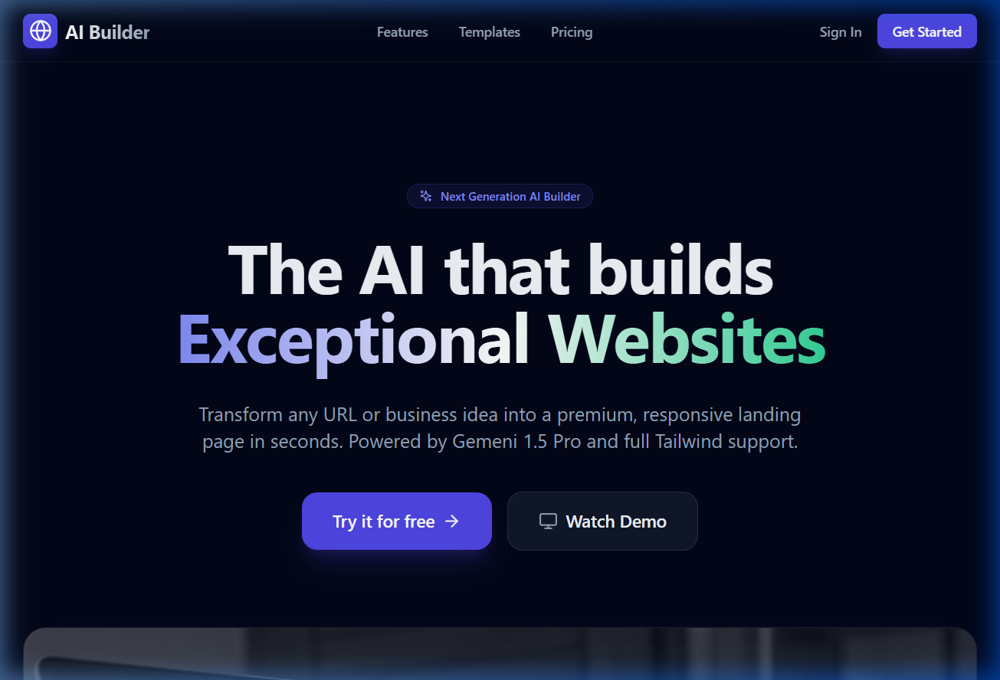

# AI Website Builder - Intelligent Website Generator

AI Website Builder is a professional-grade SaaS platform that allows users to generate, refine, and deploy complete, multi-page websites using advanced AI models. Built with a modern tech stack, it features real-time project tracking, continuous AI chat refinement, and a sleek, premium user interface.



## 🚀 Key Features

- **AI-Powered Generation**: Transform simple text prompts or uploaded images into fully functional multi-page websites.
- **Continuous Refinement**: Chat with the AI to tweak styles, add sections, or update content in real-time.
- **Dynamic Dashboard**: Manage your projects, track your site usage (Free Plan: up to 50 sites), and view live previews.
- **Structured JSON Engine**: Sites are generated as structured data, allowing for perfect portability and consistent rendering.
- **Secure Authentication**: Built-in user profiles, password resets, and secure data isolation via Firebase.
- **Modern Performance**: Lightning-fast builds with Vite and fluid animations with Framer Motion.

## 🛠️ Tech Stack

- **Frontend**: React.js (Vite), TailwindCSS, Lucide Icons, Framer Motion.
- **Backend & Host**: Vercel (Serverless Functions).
- **Database & Auth**: Firebase (auth + firestore).
- **AI Core**: Google Gemini 2.5 Flash (via API).
- **Deployment**: Automated production pipelines on Vercel.

## 🚦 Getting Started

### Prerequisites

- Node.js (v18+)
- Firebase Account
- Google AI (Gemini) API Key

### Installation

1. **Clone the repository**:
   ```bash
   git clone https://github.com/jatin8469/Ai-Web-clone-builder.git
   cd ai-builder
   ```

2. **Install dependencies**:
   ```bash
   npm install
   ```

3. **Environment Setup**:
   Create a `.env.local` file and add your credentials:
   ```env
   VITE_FIREBASE_API_KEY=your_key
   VITE_FIREBASE_AUTH_DOMAIN=your_domain
   VITE_FIREBASE_PROJECT_ID=your_id
   VITE_FIREBASE_STORAGE_BUCKET=your_bucket
   VITE_FIREBASE_MESSAGING_SENDER_ID=your_sender_id
   VITE_FIREBASE_APP_ID=your_app_id
   
   OPENROUTER_API_KEY=your_gemini_api_key
   ```

4. **Run development server**:
   ```bash
   npm run dev
   ```

## 🏗️ Project Structure

- `/src/pages/Builder`: The core AI generation interface.
- `/src/pages/DashboardViews`: User-specific project management and analytics.
- `/src/components/Dashboard`: Reusable dashboard layouts and sidebars.
- `/api`: Vercel Serverless Functions handling AI generation and scraping.

## 📄 License

Distributed under the MIT License. See `LICENSE` for more information.

---
*Built with ❤️ by AI Website Builder Team.*
